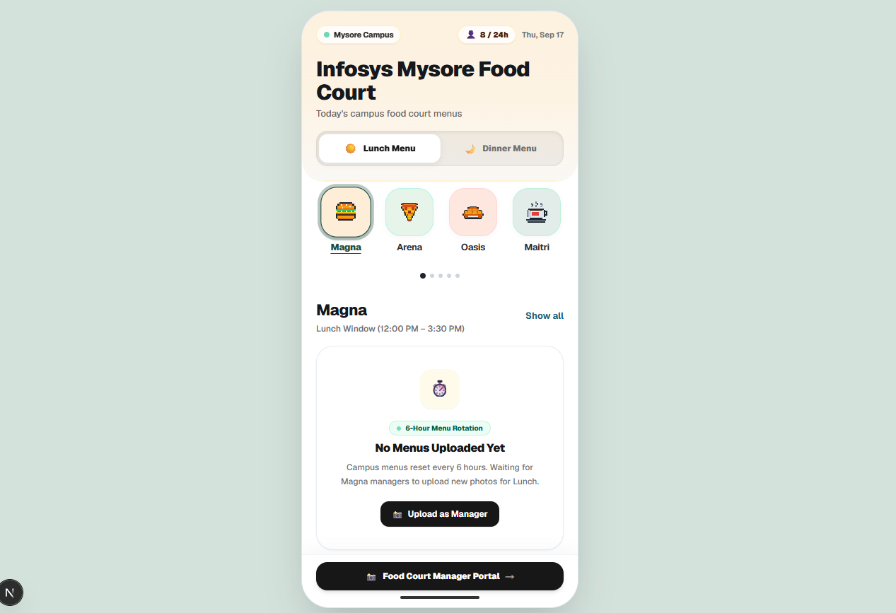

# 🍽️ Infosys Mysore Food Court

**Your daily campus dining companion — browse live menus across all 8 food courts in seconds.**

 

 
 

---

## 🌟 Why We Built This

The **Infosys Mysore Development Center** spans over **350 acres** and hosts thousands of software trainees, engineers, managers, and campus visitors every day.

With **8 distinct food courts** distributed across different corners of the campus, trainees and employees face the same daily dilemma:

> _"What is special for lunch today?"_  
> _"Is Arena serving Biryani tonight, or should we go to Meghna or Oasis?"_  
> _"Did Maitri update its menu board, or is it already crowded?"_

Walking across a massive campus under the hot Mysore sun or evening rain just to read a physical menu board takes valuable break time.

**We built this app to solve that problem once and for all.**

It puts the entire dining ecosystem of Infosys Mysore directly into your pocket:

- ⏱️ **Zero Wasted Walks**: Know what's cooking before leaving your classroom, lab, or hostel room.
- 📸 **Real Menu Photos**: View the exact chalkboard specials and outlet menus updated directly by managers.
- 🎯 **Effortless Discovery**: Compare dishes across multiple food courts side-by-side in under 10 seconds.

---

## ✨ Features Built for Campus Life

### 🍱 All 8 Food Courts at a Glance

Quickly switch between food courts or view a campus-wide feed. Category icons and clean pastel cards make navigation fluid and intuitive.

### ☀️🌙 Automatic Lunch & Dinner Switcher

The app automatically detects the current time and presents the active meal session (Lunch vs. Dinner). You can also toggle between lunch and dinner anytime to plan your meals ahead.

### 🔍 Pinch & Zoom Menu Boards

Click on any daily special or outlet card to view the high-resolution photo of today's menu. Tap to zoom in on specific item lists, prices, and combos.

### ⏱️ Always Fresh, Never Outdated

Menus automatically rotate across meal cycles so you are always seeing what is currently being served — never stale images from past days.

### 📱 Fast & Responsive Mobile Experience

Crafted with mobile-first aesthetics, smooth horizontal category scrolling, zero clutter, and full touch optimization for iOS, Android, Chrome, and Brave browsers.

### 👨‍🍳 Direct Food Court Manager Uploads

A dedicated manager portal allows food court caterers and managers to snap a quick photo of their chalkboard or counter menu and publish it live to the entire campus instantly.

---

## 📍 All 8 Campus Food Courts

| #   | Food Court  | Ambience & Highlights                                                      |
| --- | ----------- | -------------------------------------------------------------------------- |
| 1   | **Meghna**  | North Zone dining hub with popular daily lunch and dinner specials         |
| 2   | **Arena**   | Near the Sports Complex, perfect for post-workout meals and hearty dinners |
| 3   | **Oasis**   | South Zone court offering quick bites, meals, and bakery favourites        |
| 4   | **Maitri**  | Centrally located main dining hall serving classic regional specialties    |
| 5   | **Enroute** | Express dining tailored for quick transition meals between training blocks |
| 6   | **ILI**     | Executive lounge and dining area adjacent to the training facilities       |
| 7   | **Ameba**   | Vibrant central food court with diverse culinary counters                  |
| 8   | **Festa**   | Spacious guest and employee dining court with varied meal choices          |

---

## 📱 How to Use

1. **Open the Website** on your phone or laptop.
2. The app will greet you with the active meal window (**Lunch** or **Dinner**).
3. **Tap any Food Court icon** (Meghna, Arena, Oasis, etc.) to view its menus, or click **"Show all"** to browse everything campus-wide.
4. **Tap a menu card** to open the full picture, zoom in, and check prices and options.
5. If you're a food court manager, tap **"Food Court Manager Portal"** at the bottom to post today's latest photo!

---

_Built with ❤️ for trainees, employees, and visitors at the Infosys Mysore Campus._

